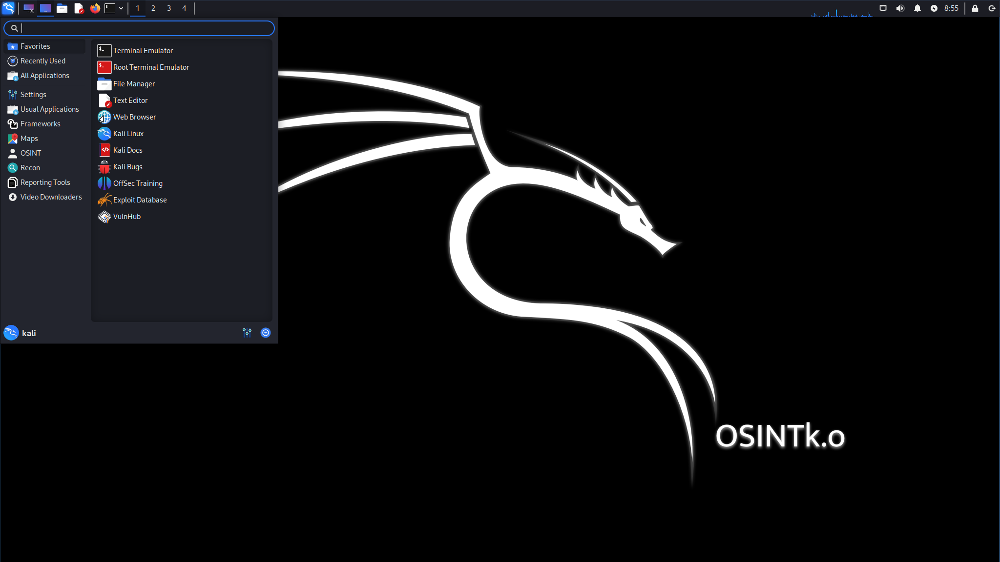

# OSINTk.o - Kali Linux based ISO for OSINT investigations.

# The Project 

OSINTk.o is a customized Kali Linux-based ISO image with pre-installed packages and scripts. The idea behind this project is to combine a portion of Kali Linux tools and some OSINT scripts that are freely available on GitHub.

I started OSINTk.o as an educational and fun project to dive deeply into Kali Linux. My idea was to create a VM with some Kali generic tools and pre-installed OSINT scripts. I learned a lot, and although it may not seem like it at first glance, configuring XFCE menues and correctly placing Python scripts and their dependencies has its challenges when embedding them in an installable ISO.  
However, I am not the one that got this idea first. I was inspired by [Trace Labs VM](https://github.com/tracelabs/tlosint-live) and [CyberPunkOS](https://github.com/cyberpunkOS/CyberPunkOS). 

# Requirements

The official Kali documentation states that you will need a bootable USB drive or virualization tool to run the distro. A minimum of 3GB of RAM and 20GB of hard disk is required. 

# Download

Download the ISO file from my [my personal website](https://yordanova.info/kali-linux-osintko-amd64.iso) and install it on your preferred virtualization tool. I have tested it on UTMapp and VirtualBox. The image size is 3.9GB. 

# Tools and Programs included

## Frameworks

- [LinkScope](https://github.com/AccentuSoft/LinkScope_Client)
- [Maltego](https://www.maltego.com/)
- [Netcat](https://netcat.sourceforge.net/)
- [Nmap](https://nmap.org/download.html)
- [Recon-ng](https://github.com/lanmaster53/recon-ng)
- [Spiderfoot](https://github.com/smicallef/spiderfoot)
- [Tcpdump](https://github.com/the-tcpdump-group/tcpdump)
- [theHarvester](https://github.com/laramies/theHarvester)
- [Wireshark](https://github.com/wireshark/wireshark)

## Maps

- [Marble](https://marble.kde.org/install.php)
- [FoxtrotGPS](https://www.foxtrotgps.org/)
- [Gnome-Maps](https://download.gnome.org/sources/gnome-maps/45/)

## OSINT

### Social Media

- [FacebookChecker](https://github.com/yasserjanah/FacebookChecker/releases)
- [GitSint](https://github.com/N0rz3/GitSint)
- [Instaloader](https://github.com/instaloader/instaloader)
- [Osgint](https://github.com/hippiiee/osgint)

### Email

- [Eyes](https://github.com/N0rz3/Eyes)
- [H8mail](https://github.com/khast3x/h8mail)
- [Holehe](https://github.com/megadose/holehe)
- [Unfoga](https://github.com/robertswin/Infoga)

### Phone number

- [Findigo](https://github.com/De-Technocrats/findigo)
- [No-infoga](https://github.com/akashblackhat/no-infoga.py)
- [PhoneNumber-OSINT](https://github.com/SpiderAnongreyhat/PhoneNumber-OSINT)

### Username

- [Aliens Eye](https://github.com/arxhr007/Aliens_eye)
- [Blackbird](https://github.com/p1ngul1n0/blackbird)
- [Lawliet](https://github.com/RedKatz/Lawliet)
- [Sherlock](https://github.com/sherlock-project/sherlock)
- [Social-Analyzer](https://github.com/qeeqbox/social-analyzer)
- [Socialscan](https://github.com/iojw/socialscan)
- [Tracer](https://github.com/chr3st5an/tracer)

## Recon

- [Amass](https://github.com/owasp-amass/amass)
- [Crawler](https://github.com/eldraco/domain_analyzer)
- [Domain Analyzer](https://github.com/eldraco/domain_analyzer)
- [WhatWeb](https://github.com/urbanadventurer/WhatWeb)
- [WPscan](https://github.com/wpscanteam/wpscan)

## Reporting Tools

- [CherryTree](https://github.com/giuspen/cherrytree)
- [Drawing](https://github.com/maoschanz/drawing)
- [Eyewitness](https://github.com/RedSiege/EyeWitness)
- [Joplin](https://github.com/laurent22/joplin)

## Video Downloaders

- [ClipGrab](https://clipgrab.org/faqs/howto-download-youtube-video)
- [FFmpeg](https://github.com/FFmpeg/FFmpeg)
- [Video Downloader](https://github.com/Unrud/video-downloader)
- [Yt-dlp](https://github.com/yt-dlp/yt-dlp)

## Kali Linux Usual Applications
- Accessories
- Development
- Graphics
- Internet
- Multimedia
- Office
- Other
- System

# Known Issues

Some of the Python scripts require sudo to read the output. The typical error that follows is from the type "permission denied". Use sudo if you want to save and read the final result. 

# A note on Python scripts: Kali is retiring pip install

In the [blog post](https://www.kali.org/blog/python-externally-managed/) from 6th of July this year, Kali Linux distro developers announced that Python packages outside the package manager should be in the future insalled in a virtual environment. Though pip install still works, it wont be for too long. With the next Python3.12, Kali will officially retire it. 

# Feedback

If you have any feedback,suggestions or comments please reach out to me at schefflina@gmail.com

# Disclaimer

**Educational Purpose Only: This software is provided for educational purposes only. It is not intended for production use or any critical applications.**

By using this software, you understand and agree that:

- This software is for educational purposes and should not be used in any mission-critical or production environments.

- The software may contain errors, bugs, or vulnerabilities, and should not be relied upon for any real-world applications.

- You are solely responsible for any consequences, including but not limited to data loss, damage, or security breaches, that may occur as a result of using this software.

- The authors and contributors of this software are not responsible for any damages or losses, direct or indirect, that may result from the use of this software.

Please use this software responsibly and with the understanding that it is for educational purposes only. If you require a production-ready solution, it is recommended to seek professional software or services.

**You use this software at your own risk.**