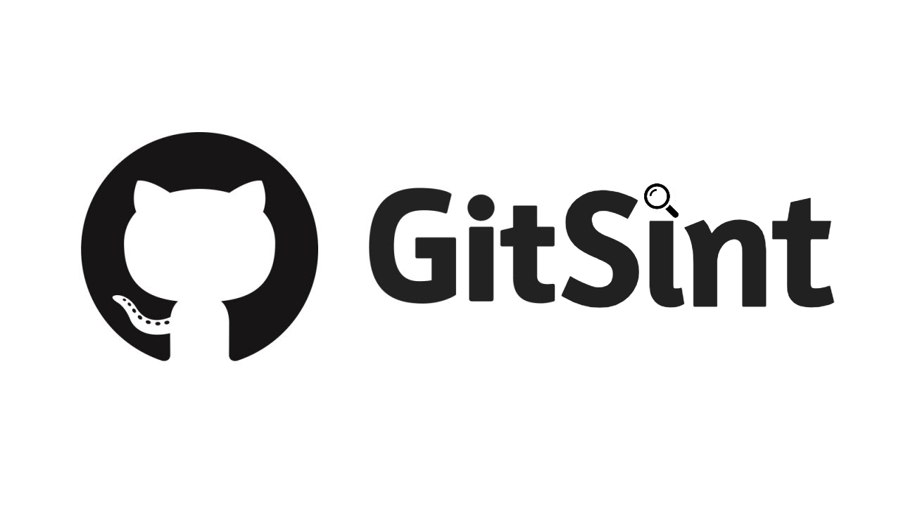

<h1 align="center" id="title">🔎🐈 G i t S i n t</h1>


[](https://www.python.org/downloads/)
[](https://www.gnu.org/licenses/gpl-3.0.fr.html)

# **😇 About GitSint**
> 🕵️ GitSint v2.0 is an osint tool based on open source information retrieval through a GitHub username/organization/email.
> The tool mostly works with GitHub APIs.

**Features of script**
- fully async
- asynchrone scraping 
- menu in cli format (commands)

**GitSint extracts various information like**
- login
- name
- email
- id
- biography
- location
- avatar (+ upload)
- followers
- following
- repos
- gists
- dates
- X (Twitter)
- GitLab
- blog
- company (+ domain)
- organizations
- friends
- contributions
- similar names
- emails related
- names related
- names used
- email to account

👀 **The information found by GitSint is presented in the form of a tree structure for better navigation.**


## **🎉What's new ?**

- Fully asynchrone system
- Completely redone design
- Adding email to username
- GitLab name
- Information searches from an organization
- Search for domains via Hunter.io
- Light mode
- Avatar upload
- Search for similar names


## **📦 Installation**

- [Python 3](https://www.python.org/downloads/)
- [Git](https://git-scm.com/downloads)

```
$ git clone https://github.com/N0rz3/GitSint.git
$ cd ./GitSint
$ pip install -r requirements.txt
```

## **🎲 Usage**

```
usage: gitsint.py [-h] [-u [USERNAME]] [-o [ORGANIZATION]] [-e [EMAIL]] [-f [FRIENDS]] [-l] [-a [AVATAR]]
                  [-s [SIMILAR]]

options:
  -h, --help            show this help message and exit
  -u [USERNAME], --username [USERNAME]
                        searches all public information by username
  -o [ORGANIZATION], --organization [ORGANIZATION]
                        searches all public information by organization
  -e [EMAIL], --email [EMAIL]
                        search for an account by email
  -f [FRIENDS], --friends [FRIENDS]
                        search for potential friends by username
  -l, --light           light mode with option '-e'
  -a [AVATAR], --avatar [AVATAR]
                        download profile picture (avatar) by username
  -s [SIMILAR], --similar [SIMILAR]
                        search for similar names by username

```
[Light mode] run light mode with this usage: `$ python ./gitsint.py -l -e <email address>`

## 🌞 More

###  🛡️ Protection

If you don't want to display your email address in the commits and leave it private, you just have to go to 

**settings -> emails**  
and tick these two parameters


*I invite you to read this guide which will explain how to protect your personal data on GitHub. [(DOC)](https://docs.github.com/en/authentication/keeping-your-account-and-data-secure/removing-sensitive-data-from-a-repository)*

### **🗿 Contributions**
Make a [pull requests](https://github.com/N0rz3/GitSint/pulls) with all the details needed to contribute of the cat work 😺

### **✔️ / ❌ Rules**

**this tool was designed for educational purposes only and is not intended for any mischievous use, I am not responsible for its use.**

### **📜 License**

**This project is [License GPL v3](https://www.gnu.org/licenses/gpl-3.0.fr.html) be sure to follow all rules 👍**

### **💖 Thanks**
- If you like what i do please subscribe 💖. And if you find this tool is useful don't forget to star 🌟
- This tool is inspired by [GitFive](https://github.com/mxrch/GitFive) made by [mxrch](https://github.com/mxrch)

**💶 Support me 👇**

<a href="https://www.buymeacoffee.com/norze" target="_blank"></a> 
